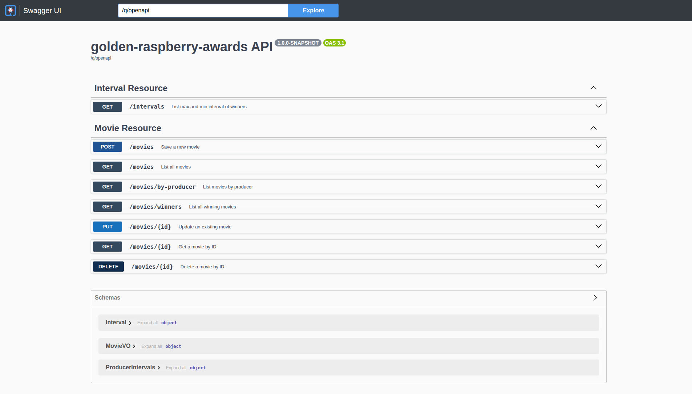

# golden-raspberry-awards

Este projeto é uma API REST para gerenciar e informar a respeito de filmes relativos ao prêmio Golden Raspberry Awards,
também conhecido como "Framboesa de Ouro", que é uma premiação anual que reconhece os piores filmes do ano.

Essa aplicação utiliza Quarkus como framework, e é capaz de realizar operações CRUD (Create, Read, Update, Delete) em
filmes, além de fornecer informações sobre o maior e menor intervalo de vencedores do prêmio

Foi implementada uma aplicação que é responsável por ler um arquivo CSV que contém os dados dos filmes e popular o banco
de dados H2 com essas informações. O arquivo CSV deve estar localizado na pasta `src/main/resources/Movielist.csv` do
projeto.

Foi implementado um arquivo Makefile para facilitar a execução de comandos comuns do projeto, como iniciar a aplicação.

Para executar a aplicação, você pode utilizar o comando:

```bash
make run
```

## Endpoints

Os endpoints disponíveis podem ser acessados através do swagger da aplicação, que está disponível em:

```
http://localhost:8080/q/swagger-ui/#/
```



## Testes

Para executar os testes da aplicação, você pode utilizar o comando:

```bash
make test
```

Ou:

```bash
./mvnw test
```

## Docker

Para executar a aplicação em um container Docker, você pode utilizar o comando:

```bash
make run-docker
```

Para verificar os logs do container

```bash
make logs
```
